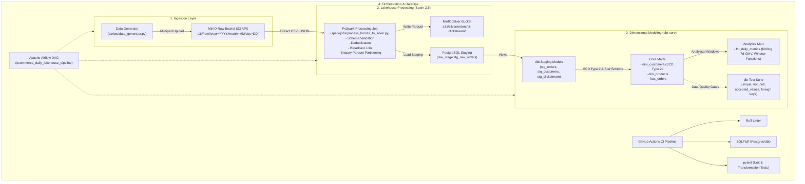

# E-Commerce Lakehouse & Analytics Platform

[](https://github.com/aayushm02/ecommerce-lakehouse-platform/actions/workflows/ci.yml)
[](https://www.python.org/)
[](https://spark.apache.org/)
[](https://www.getdbt.com/)
[](https://airflow.apache.org/)

An end-to-end, production-grade, containerized Lakehouse & Analytics platform built to demonstrate the core architecture, data modeling, and engineering practices of modern data engineering.

---

## 🏛️ Architecture & Data Flow



---

## 💡 Key Technical Skills Showcased

| Domain | Skill / Pattern | Implementation in Project |
| :--- | :--- | :--- |
| **Lakehouse Storage** | S3-Compatible Object Storage | MinIO with partitioned paths (`year=YYYY/month=MM/day=DD/`) and Snappy Parquet compression. |
| **Distributed Compute** | PySpark Optimization | Adaptive Query Execution (AQE), broadcast joins for product catalog lookup, partition pruning, and schema enforcement. |
| **Data Modeling** | Kimball Dimensional Modeling | Star Schema (`fact_orders`, `dim_products`) and **SCD Type 2** (`dim_customers` with `valid_from`, `valid_to`, `is_current`). |
| **Advanced SQL** | Window Functions & CTEs | Rolling 7-day revenue, cumulative GMV, day-over-day growth rate, and category ranking in `fct_daily_metrics.sql`. |
| **Transformations** | dbt (data build tool) | Multi-hop staging $\to$ core $\to$ analytics layers, custom singular tests, and documentation. |
| **Orchestration** | Apache Airflow | Deterministic batch DAG with idempotent execution using `{{ ds }}` macros, retries, and task dependencies. |
| **DataOps & CI/CD** | Automated Quality Gates | Docker Compose containerization, GitHub Actions running `ruff`, `sqlfluff`, and `pytest`. |

---

## 📁 Repository Structure

```
ecommerce-lakehouse-platform/
├── .github/
│   └── workflows/
│       └── ci.yml               # Automated CI/CD (Ruff, SQLFluff, PyTest)
├── airflow/
│   ├── dags/
│   │   └── ecommerce_batch_pipeline.py  # Airflow DAG definition
│   ├── Dockerfile               # Airflow image with Java 17 + PySpark + dbt
│   └── requirements.txt         # Containerized Airflow dependencies
├── spark/
│   ├── jobs/
│   │   └── process_bronze_to_silver.py  # PySpark extraction & enrichment job
│   └── Dockerfile               # Spark master/worker image
├── dbt_project/
│   ├── dbt_project.yml          # dbt configuration
│   ├── profiles.yml             # PostgreSQL warehouse connection profile
│   ├── models/
│   │   ├── staging/             # Cleaned views on raw tables
│   │   │   ├── schema.yml
│   │   │   ├── stg_orders.sql
│   │   │   ├── stg_customers.sql
│   │   │   └── stg_clickstream.sql
│   │   └── marts/
│   │       ├── core/            # Star Schema + SCD Type 2
│   │       │   ├── schema.yml
│   │       │   ├── dim_customers.sql (SCD Type 2)
│   │       │   ├── dim_products.sql
│   │       │   └── fact_orders.sql
│   │       └── analytics/       # Window functions & KPIs
│   │           ├── schema.yml
│   │           └── fct_daily_metrics.sql
│   └── tests/
│       └── assert_positive_order_amounts.sql  # Custom dbt test
├── scripts/
│   ├── data_generator.py        # Synthetic clickstream & transaction generator
│   └── init_warehouse.sql       # Postgres schema initialization
├── tests/
│   ├── __init__.py
│   ├── test_data_generator.py   # Unit tests for data generation
│   └── test_spark_transforms.py # PySpark DataFrame unit tests
├── docker-compose.yml           # Complete multi-container platform definition
├── .env.example                 # Environment variables template
├── .sqlfluff                    # SQLFluff linting rules for dbt
├── pyproject.toml               # Tooling & pytest configurations
├── requirements.txt             # Local development dependencies
└── README.md
```

---

## 🚀 Quickstart Guide

### 1. Prerequisites
* [Docker Desktop](https://www.docker.com/products/docker-desktop/) (ensure Docker daemon is running)
* Python 3.10+ (for local development/testing)

### 2. Clone & Setup Environment
```bash
git clone https://github.com/your-username/ecommerce-lakehouse-platform.git
cd ecommerce-lakehouse-platform
cp .env.example .env
```

### 3. Spin Up the Platform
Start all services (MinIO, PostgreSQL, Spark Master/Worker, Airflow):
```bash
docker compose up -d --build
```

Verify that all services are healthy:
```bash
docker compose ps
```

### 4. Service Endpoints & Web UIs
| Service | URL | Credentials |
| :--- | :--- | :--- |
| **Apache Airflow** | [http://localhost:8082](http://localhost:8082) | `admin` / `admin` |
| **MinIO Console (S3)** | [http://localhost:9001](http://localhost:9001) | `minioadmin` / `minioadmin` |
| **Apache Spark Web UI** | [http://localhost:8080](http://localhost:8080) | *No auth required* |
| **PostgreSQL Warehouse** | `localhost:5432` (db: `warehouse`) | `postgres` / `postgres` |

---

## ⚙️ Running the Pipeline

### Option A: Via Airflow Web UI (Recommended)
1. Open [http://localhost:8082](http://localhost:8082).
2. Find the DAG **`ecommerce_daily_lakehouse_pipeline`**.
3. Toggle the DAG switch to **Active** and click **Trigger DAG**.
4. Monitor the task tree:
   ```
   generate_and_ingest_raw_data ➔ spark_bronze_to_silver_transform ➔ dbt_transform_models ➔ dbt_test_data_quality
   ```

### Option B: Step-by-Step Manual Execution

#### 1. Generate & Ingest Raw Data:
```bash
python scripts/data_generator.py --date 2026-03-20 --output minio
```

#### 2. Run PySpark Bronze-to-Silver Job:
```bash
python spark/jobs/process_bronze_to_silver.py --date 2026-03-20 --storage-type minio
```

#### 3. Run dbt Transformations & Tests:
```bash
cd dbt_project
dbt run
dbt test
```

---

## 🔍 Deep-Dive: Core Engineering Designs

### 1. Slowly Changing Dimension (SCD Type 2) in dbt
Customer tier movements and address changes are tracked historically using SQL window functions (`LEAD`) in [`dim_customers.sql`](file:///c:/Users/mishr/OneDrive/Desktop/claude/ecommerce-lakehouse-platform/dbt_project/models/marts/core/dim_customers.sql):
```sql
scd2_windows AS (
    SELECT
        customer_id,
        customer_tier,
        city,
        updated_at AS valid_from,
        LEAD(updated_at) OVER (
            PARTITION BY customer_id 
            ORDER BY updated_at
        ) AS next_updated_at
    FROM unique_snapshots
)
```
Orders in `fact_orders` join to `dim_customers` on:
```sql
order_timestamp >= valid_from AND order_timestamp < valid_to
```
This guarantees 100% accurate point-in-time attribution even after a customer upgrades tiers.

### 2. PySpark Optimization: Broadcast Joins
In [`process_bronze_to_silver.py`](file:///c:/Users/mishr/OneDrive/Desktop/claude/ecommerce-lakehouse-platform/spark/jobs/process_bronze_to_silver.py), the high-volume transactional orders dataset is joined with the reference product catalog using `broadcast()`:
```python
df_orders_enriched = df_orders_clean.join(
    broadcast(df_products_raw), on="product_id", how="left"
)
```
This prevents expensive network shuffling across cluster executors.

### 3. Advanced Analytical Windows in dbt Marts
In [`fct_daily_metrics.sql`](file:///c:/Users/mishr/OneDrive/Desktop/claude/ecommerce-lakehouse-platform/dbt_project/models/marts/analytics/fct_daily_metrics.sql), moving averages and cumulative aggregates are calculated efficiently:
```sql
-- Rolling 7-day revenue window
ROUND(
    SUM(daily_gmv) OVER (
        ORDER BY order_date 
        ROWS BETWEEN 6 PRECEDING AND CURRENT ROW
    ), 2
) AS rolling_7d_gmv,

-- Cumulative all-time GMV
ROUND(
    SUM(daily_gmv) OVER (
        ORDER BY order_date 
        ROWS BETWEEN UNBOUNDED PRECEDING AND CURRENT ROW
    ), 2
) AS cumulative_gmv
```

---

## 🧪 Testing & Code Quality

Run tests locally:
```bash
# Run pytest test suite
pytest tests/ -v

# Run Python code linting
ruff check .

# Run SQL style linting
sqlfluff lint dbt_project/models/
```

---

## 💬 Interview Discussion Points

When discussing this project in a Data Engineering interview:
1. **Explain the Storage & Architecture**: Discuss why MinIO was chosen as an S3 object store emulation for Bronze/Silver layers, and why PostgreSQL/Snowflake handles Gold-layer analytical queries.
2. **Explain Distributed Bottlenecks**: Explain how broadcast joins mitigate shuffle overhead when enriching transactions with product metadata.
3. **Explain Idempotency**: Detail how Airflow's `{{ ds }}` parameter enables safe re-runs and historical backfilling without duplicate records.
4. **Explain Data Quality & Modeling**: Walk through how SCD Type 2 maintains historical truth and how dbt automated tests prevent bad data from leaking into downstream business reports.
